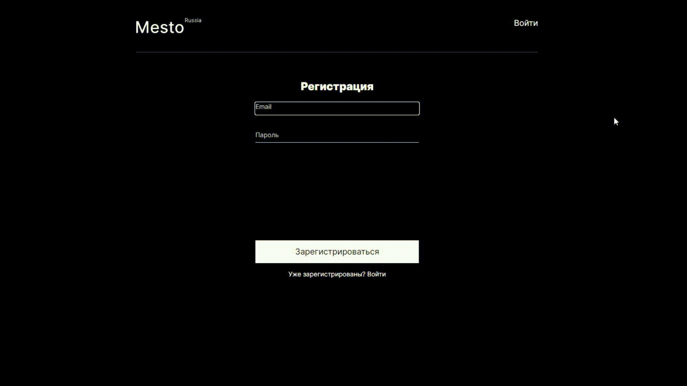
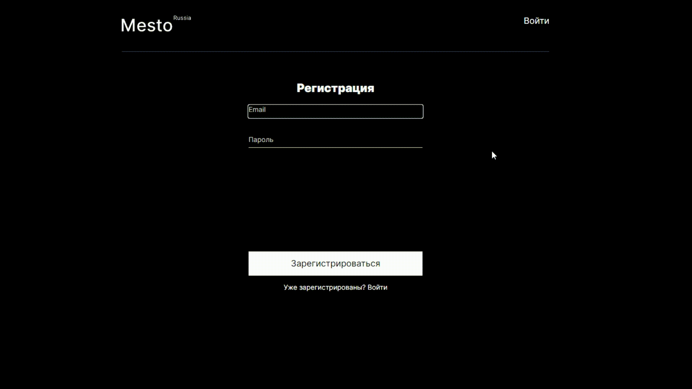
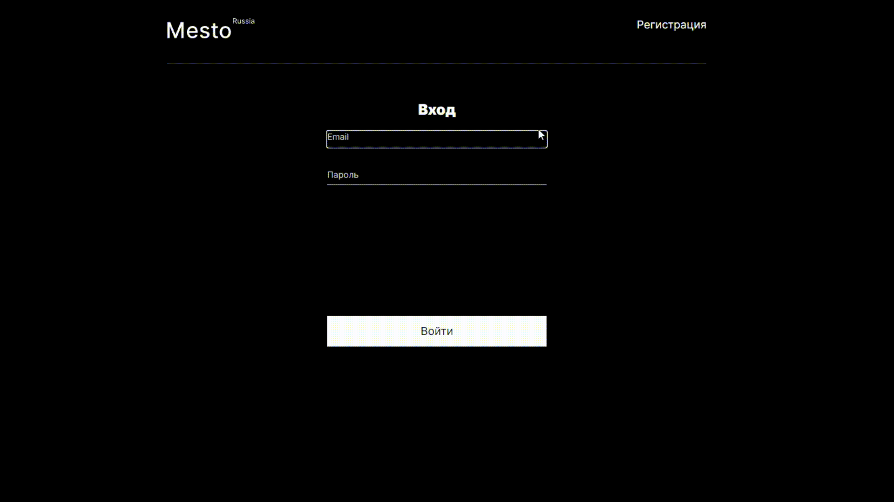
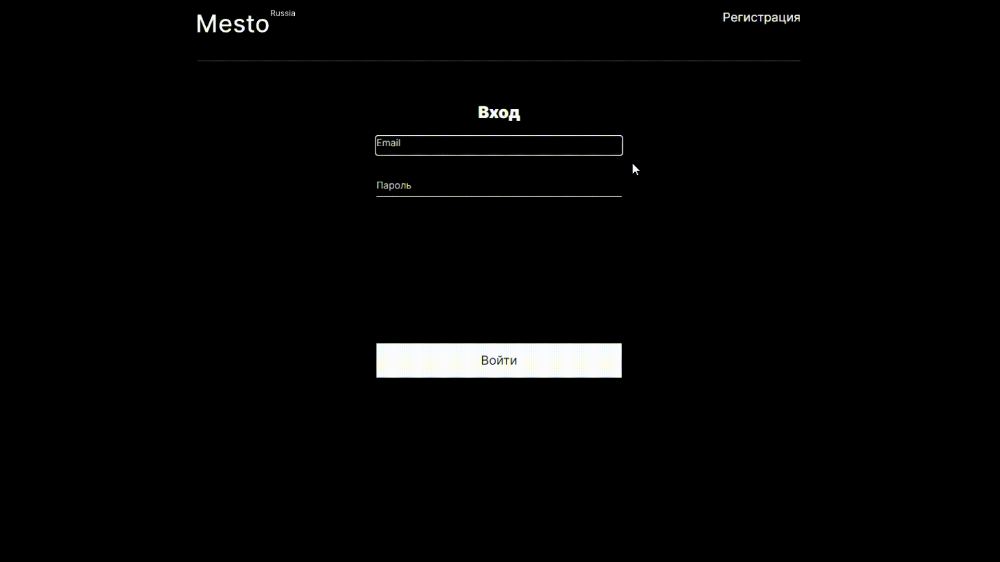
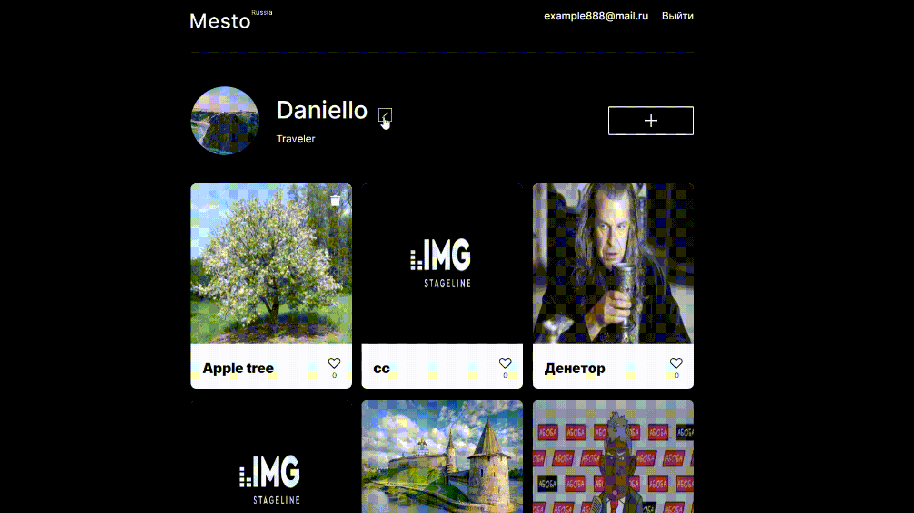
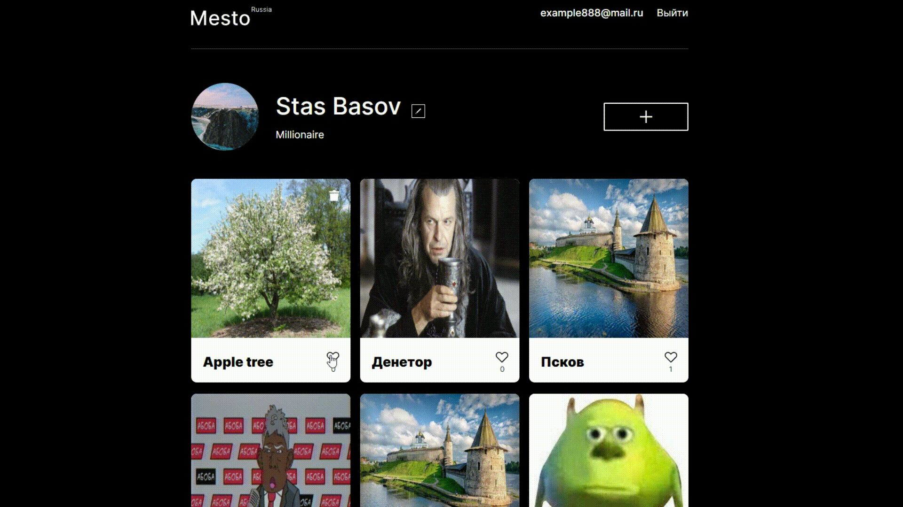
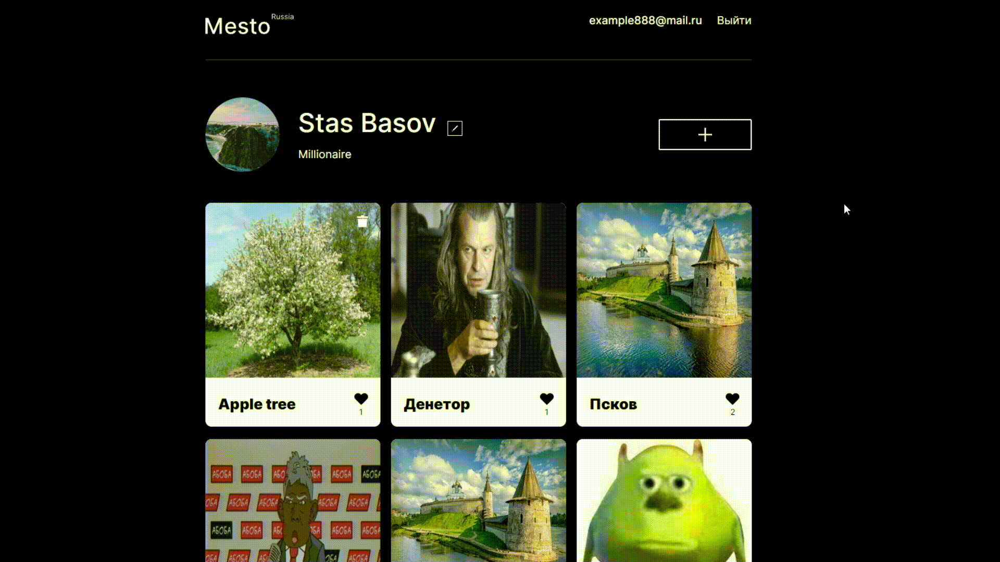

<h1 align="center">Project "Place" with authorization and registration!</h1>

<h2 align="center"><a  href="https://danielloxxi.github.io/react-mesto-auth/#/sign-in">Test site</a></h2>

## Description

The project supports registration, authorization, allows you to share cards with users, view them, delete and like them, change your avatar and nickname

## Used technologies: 

- **CSS BEM** 
- **HTML** 
- **React**
- **JS**

## Registration

### Sign up for your account on our website!

- **Enter email** 
- **Enter Password** 
- **Get a successful registration!**

### Entered an invalid email address? Try again, we will help you!

## Authorization

### Already registered? Run to log in!

- **Enter email** 
- **Enter Password** 
- **Get a successful authorization!**

### **Congratulations!**

### Just entered the wrong password or hacked into someone else's account? Confess!

## Add your first card to the common base!

## Who are you today?

### Change your name and status! (Today I am Stas Basov - a millionaire)

## Get a lot of likes!

## Submit your favorite photo!

## Are you leaving already? 

### You can delete your card and exit your profile!

## Try the old version in pure JavaScript!

<a href="https://github.com/DanielloXXI/mesto-react"><a>
